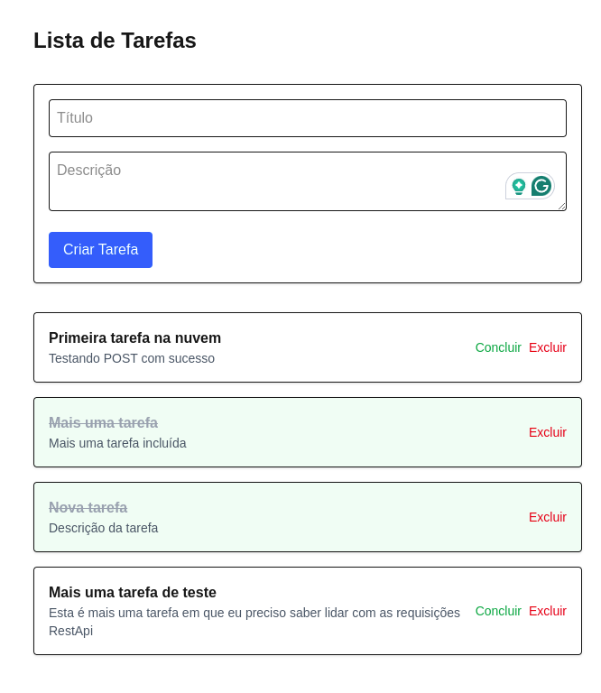

[](https://task-frontend-one-sigma.vercel.app)

# 📝 Task Frontend · Next.js + Tailwind + API REST

Interface moderna e responsiva para gerenciamento de tarefas (CRUD), integrada com uma API RESTful em produção.  
100% funcional, publicado na Vercel e conectado a banco de dados real via Railway.

---

## 🚀 Funcionalidades

- Listagem de tarefas
- Criação de novas tarefas
- Marcação como concluída ✅
- Exclusão de tarefas ❌
- Integração total com backend em produção

---

## 🧰 Tecnologias utilizadas

- [Next.js](https://nextjs.org/)
- [TypeScript](https://www.typescriptlang.org/)
- [Tailwind CSS](https://tailwindcss.com/)
- API REST em Node.js (hospedada na Railway)

---

## 🔗 Links rápidos

- 🔥 App online: [task-frontend-one-sigma.vercel.app](https://task-frontend-one-sigma.vercel.app)
- 🧠 API: [task-api-production-aca3.up.railway.app](https://task-api-production-aca3.up.railway.app)
- 📁 Repositório do backend: [github.com/rafaellpaula/task-api](https://github.com/rafaellpaula/task-api)

---

## 🖼️ Screenshot



---

## 📦 Instalação local

```bash
# Clone o repositório
git clone https://github.com/rafaellpaula/task-frontend.git

# Acesse a pasta
cd task-frontend

# Instale as dependências
npm install

# Execute o projeto
npm run dev
